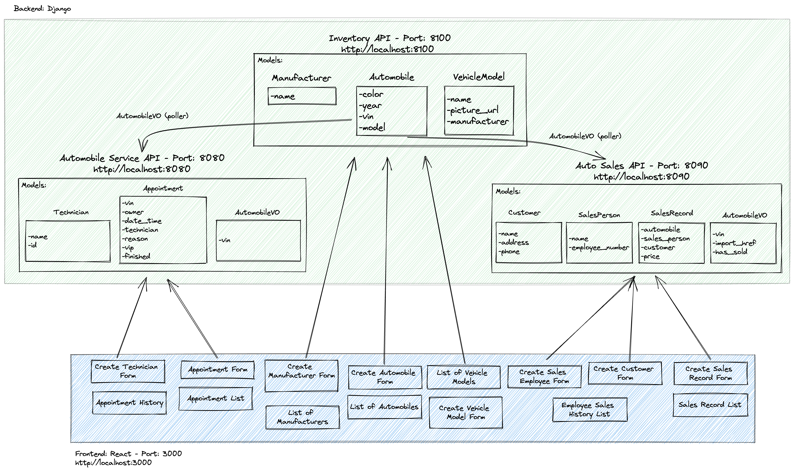

# Auto Aid

Team:

* Person 1 (Nicolette) - Automobile services
* Person 2 (Cindy) - Auto Sales

## Design

Auto Aid is an application for managing aspects of an automobile dealership, specifically for its inventory, service center, and sales.

In our application we utilized the approach of Domain Driven Design to create the architecture based on our problem domain. With this approach we defined three bounded contexts which led us to create microservices based on those contexts.

The application was designed with three microservices: the inventory, automobile services, and auto sales. Below is a diagram that further details the relationships between these services with the frontend. The backend of the application was developed with a Django framework and Python. The frontend of the application was developed with React.



Within the repository, you'll find ghi, inventory, sales, and service directories.
- ghi contains the frontend React files.
- inventory contains the backend api for managing the models, views, and urls of manufacturers, vehicle models, and automobiles.
- sales contains the backend api for managing the models, views, and urls of employees, customers, sales records, and employee sales history. It also contains the poller to pull automobile data from the inventory api.
- service contains the backend api for managing the models, views, and urls of appointments and technicians. It also contains the poller to pull automobile data from the inventory api.

## Getting Started

Please note the following directions to start the application:
1. Fork and clone from the repository https://gitlab.com/nmabeza/project-beta.
2. Upon opening the repository, please click on the clone button and select "Clone with HTTPS".
3. Open a terminal and navigate to the directory where this application will be stored. To navigate to a directory, use the command `cd <<directory name>>`. If you need to make a new directory, use the command `mkdir <<directory name>>`.
4. Once you've navigated to the appropriate directory, execute the comand `git clone` and paste the copied repository link.
5. Then enter `code .` to open the application in Visual Studio Code.
6. Because this application will require the use of Docker, you'll need to execute the following commands in the terminal in this order:

        docker volume create beta-data
        docker-compose build
        docker-compose up

7. To view the application, go to http://localhost:3000.

// Note: When you run `docker-compose up` and if you're on macOS, you will see a warning about an environment variable named OS being missing. You can safely ignore this.


## Service microservice

On the Service microservice you can:

- Create a technician by providing a name and employee number
- Create an appointment by providing a VIN number, owner name, date and time of appointment, selecting a technician, and the reason for the service appointment
- View a list of appointments that have not been finished and view the VIP status of each vehicle
- View the service appointment history (both finished and unfinished) of a specific vehicle by searching the VIN number

The models within the sales microservice include:

- Appointment Model: a representation of an appointment with attributes of vin, owner, data/time, technician, reason, vip, and finished.
- Technician Model: a representation of a technician with attributes of name and employee_number
- AutomobileVO: a representation of getting automobile data from the Inventory API with attributes of VIN and import_href.

The Service microservices is in charge of service appointments and technicians. With appointments you are able to create an appointment, view a list of active appointments, and view a vehicle’s appointment history (both finished and unfinished appointments) by searching the VIN number. You are also able to create a technician within the services microservice, which then can be utilized when creating an appointment to select a specific technician.

The Service microservice poller gets data from the inventory microservice - more specifically from its automobile API. The data we are extracting is the VIN information from the inventory and creating an Automobile VO object. We can use this information to crosscheck if a VIN entered into an appointment form has previously been in the Automobile inventory. If so, this notifies the concierge to give the customer “VIP” treatment.

The Service microservice is on port 8080 and has a url of http://localhost:8080. The api endpoints include:

| Action | Method | URL |
| --- | :---: | --- |
| List appointments | GET | `http://localhost:8080/api/appointments/`
| Create appointment | POST | `http://localhost:8080/api/appointments/`
| Get a specific appointment by VIN | GET | `http://localhost:8080/api/appointments/<str:vin>/`
| Get a specific appointment | GET | `http://localhost:8080/api/appointments/detail/<int:pk>/`
| Update a specific appointment | PUT | `http://localhost:8080/api/appointments/detail/<int:pk>/`
| Delete a specific appointment | DELETE | `http://localhost:8080/api/appointments/detail/<int:pk>/`
| List technicians | GET | `http://localhost:8080/api/technicians/`
| Create technician | POST | `http://localhost:8080/api/technicians/`
| Get a specific technician * | GET | `http://localhost:8080/api/technicians/<int:pk>/`
| Delete a specific technician * | DELETE | `http://localhost:8080/api/technicians/<int:pk>/`

// Note: endpoints with an asterisk(*) were created on the backend, but not utilized on the frontend. These can be used for further development of the application.

#### List appointments (GET)
##### Example Response
```json
{
	"appointments": [
		{
			"href": "/api/appointments/detail/1/",
			"id": 1,
			"vin": "1G1JC1243T7246823",
			"owner": "Bob Belcher",
			"date_time": "2022-10-27T10:00:00+00:00",
			"technician": {
				"href": "/api/technicians/3/",
				"name": "Louise Belcher",
				"id": 3,
				"employee_number": 1003
			},
			"reason": "Tire change",
			"vip": false,
			"finished": false
		}
	]
}
```

#### Create appointment (POST)
##### Example Request
```json
{
	"vin": "WDBRN40J54A591238",
	"owner": "Linda Belcher",
	"date_time": "2022-10-27T10:00:00+00:00",
	"technician": 3,
	"reason": "Oil change",
	"vip": false,
	"finished": false
}
```
##### Example Response
```json
{
	"href": "/api/appointments/detail/4/",
	"id": 4,
	"vin": "WDBRN40J54A591238",
	"owner": "Linda Belcher",
	"date_time": "2022-10-27T10:00:00+00:00",
	"technician": {
		"href": "/api/technicians/3/",
		"name": "Louise Belcher",
		"id": 3,
		"employee_number": 1003
	},
	"reason": "Oil change",
	"vip": false,
	"finished": false
}
```

#### Get a specific appointment by VIN (GET)
##### Example Response
```json
{
	"appointments": [
		{
			"href": "/api/appointments/detail/1/",
			"id": 1,
			"vin": "1G1JC1243T7246823",
			"owner": "Bob Belcher",
			"date_time": "2022-10-27T10:00:00+00:00",
			"technician": {
				"href": "/api/technicians/3/",
				"name": "Louise Belcher",
				"id": 3,
				"employee_number": 1003
			},
			"reason": "Tire change",
			"vip": false,
			"finished": false
		}
	]
}
```

#### Get a specific appointment (GET)
##### Example Response
```json
{
	"href": "/api/appointments/detail/4/",
	"id": 4,
	"vin": "WDBRN40J54A591238",
	"owner": "Linda Belcher",
	"date_time": "2022-10-27T10:00:00+00:00",
	"technician": {
		"href": "/api/technicians/3/",
		"name": "Louise Belcher",
		"id": 3,
		"employee_number": 1003
	},
	"reason": "Oil change",
	"vip": false,
	"finished": false
}
```

#### Update a specific appointment (PUT)
##### Example Request
```json
{
	"vin": "WDBRN40J54A591238",
	"owner": "Linda Belcher",
	"date_time": "2022-10-27T10:00:00+00:00",
	"technician": 3,
	"reason": "Paint job",
	"vip": false,
	"finished": false
}
```
##### Example Response
```json
{
	"href": "/api/appointments/detail/4/",
	"id": 4,
	"vin": "WDBRN40J54A591238",
	"owner": "Linda Belcher",
	"date_time": "2022-10-27T10:00:00+00:00",
	"technician": {
		"href": "/api/technicians/3/",
		"name": "Louise Belcher",
		"id": 3,
		"employee_number": 1003
	},
	"reason": "Paint job",
	"vip": false,
	"finished": false
}
```

#### Delete a specific appointment (DELETE)
##### Example Response
```json
{
	"message": "Appointment deleted"
}
```

#### List technicians (GET)
##### Example Response
```json
{
	"technicians": [
		{
			"href": "/api/technicians/1/",
			"name": "Bob Belcher",
			"id": 1,
			"employee_number": 1001
		}
}
```

#### Create technician (POST)
##### Example Request
```json
{
	"name": "Gene Belcher",
	"employee_number": 1005
}
```
##### Example Response
```json
{
	"href": "/api/technicians/5/",
	"name": "Gene Belcher",
	"id": 5,
	"employee_number": 1005
}
```

#### Get a specific technician (GET)
##### Example Response
```json
{
	"href": "/api/technicians/3/",
	"name": "Louise Belcher",
	"id": 3,
	"employee_number": 1003
}
```

#### Delete a specific technician (DELETE)
##### Example Response
```json
{
	"message": "Technician deleted"
}
```


## Sales microservice

The Sales microservice was developed with RESTful methods to provide frontend capabilities of managing employees, customers, sales records, and employee sales history of a automobile dealership. Additionally, the Sales microservice only allows sales of automobiles within the inventory that have not yet been sold.

The models within the sales microservice include:
- SalesPerson Model: a representation of a sales employee with attributes of name and employee number.
- Customer Model: a representation of a customer with attributes of name, address, and phone number.
- SalesRecord Model: a representation of a sales record with references to a sales person, automobile, and customer as well as a price.
- AutomobileVO: a representation of getting automobile data from the Inventory API with attributes of VIN, import_href, and has_sold.

The sales microservice poller (through the AutomobileVO model) gets data from the inventory microservice. The poller provides the VIN property, which is used to determine what automobiles are available to be sold.

The Sales microservice is on port 8090 and has a url of http://localhost:8090. The api endpoints include:

| Action | Method | URL |
| --- | :---: | --- |
| List sales employees	| GET |	`http://localhost:8090/api/salespeople/`
| Create sales employee	|POST | `http://localhost:8090/api/salespeople/`
| Get a specific employee *| GET|`http://localhost:8090/api/salespeople/<int:pk>/`
| Delete a specific employee *| DELETE | `http://localhost:8090/api/salespeople/<int:pk>/`
| Get a specific employee sales history | GET | `http://localhost:8090/api/salespeople/<int:employee_id>/salesrecords/`
| List customers | GET | `http://localhost:8090/api/customers/`
| Create customer | POST | `http://localhost:8090/api/customers/`
| Get a specific customer *| GET | `http://localhost:8090/api/customers/<int:pk>/`
| Delete a specific customer *| DELETE | `http://localhost:8090/api/customers/<int:pk>/`
| List sales records | GET | `http://localhost:8090/api/salesrecords/`
| Create sales record | POST | `http://localhost:8090/api/salesrecords/`
| Get a specific sales record *| GET | `http://localhost:8090/api/salesrecords/<int:pk>/`
| Delete a specific sales record *| DELETE | `http://localhost:8090/api/salesrecords/<int:pk>/`
| List unsold automobiles | GET | `http://localhost:8090/api/automobiles/`

// Note: endpoints with an asterisk(*) were created on the backend, but not utilized on the frontend. These can be used for further development of the application.

#### List sales employees (GET)
##### Example Response
```json
{
	"sales_people": [
		{
			"name": "Cindy",
			"employee_number": 101,
			"id": 1
		}
	]
}
```

#### Create sales employee (POST)
##### Example Request
```json
{
  "name": "Reinhardt",
  "employee_number": 103
}
```
##### Example Response
```json
{
	"name": "Reinhardt",
	"employee_number": 103,
	"id": 3
}
```

#### Get a specific employee (GET)
##### Example Response
```json
{
	"name": "Carry",
	"employee_number": 105,
	"id": 5
}
```

#### Delete a specific employee (DELETE)
##### Example Response
```json
{
	"name": "Carry",
	"employee_number": 105,
	"id": null
}
```

#### Get a specific employee sales history (GET)
##### Example Response
```json
{
	"sales_records": [
		{
			"automobile": {
				"vin": "1FTSX21P05EC23578",
				"import_href": "/api/automobiles/1FTSX21P05EC23578/"
			},
			"sales_person": {
				"name": "Barry",
				"employee_number": 102,
				"id": 2
			},
			"customer": {
				"name": "Karl the Fog",
				"address": "1 Ocean Avenue, San Francisco, CA 94107",
				"phone_number": "415-888-8888",
				"id": 6
			},
			"price": 55000,
			"id": 3
		}
	]
}
```

#### List customers (GET)
##### Example Response
```json
{
	"customers": [
		{
			"name": "Mickey Mouse",
			"address": "123 Magic Way Drive, Anaheim, CA 92807",
			"phone_number": "714-956-6425",
			"id": 1
		}
	]
}
```

#### Create customer (POST)
##### Example Request
```json
{
  "name": "Goofy",
  "address": "123 Magic Way Drive, Anaheim, CA 92807",
  "phone_number": "714-956-6425"
}
```
##### Example Response
```json
{
	"name": "Goofy",
	"address": "123 Magic Way Drive, Anaheim, CA 92807",
	"phone_number": "714-956-6425",
	"id": 5
}
```

#### Get a specific customer (GET)
##### Example Response
```json
{
	"name": "Minnie Mouse",
	"address": "123 Magic Way Drive, Anaheim, CA 92807",
	"phone_number": "714-956-6425",
	"id": 2
}
```

#### Delete a specific customer (DELETE)
##### Example Response
```json
{
	"name": "Tina Belcher ",
	"address": "5 Wonder Wharf Avenue, Seymour Bay, NJ 07051",
	"phone_number": "907-212-4583",
	"id": null
}
```

#### List sales records (GET)
##### Example Response
```json
{
	"sales_records": [
		{
			"automobile": {
				"vin": "1FMZU77KX4UA69977",
				"import_href": "/api/automobiles/1FMZU77KX4UA69977/"
			},
			"sales_person": {
				"name": "Cindy",
				"employee_number": 101,
				"id": 1
			},
			"customer": {
				"name": "Mickey Mouse",
				"address": "123 Magic Way Drive, Anaheim, CA 92807",
				"phone_number": "714-956-6425",
				"id": 1
			},
			"price": 30000,
			"id": 1
		}
	]
}
```

#### Create sales record (POST)
##### Example Request
```json
{
  "automobile": "1FTSW21P75EA53447",
  "sales_person": "1",
	"customer": "2",
	"price": 42000
}
```
##### Example Response
```json
{
	"automobile": {
		"vin": "1FTSW21P75EA53447",
		"import_href": "/api/automobiles/1FTSW21P75EA53447/"
	},
	"sales_person": {
		"name": "Cindy",
		"employee_number": 101,
		"id": 1
	},
	"customer": {
		"name": "Minnie Mouse",
		"address": "123 Magic Way Drive, Anaheim, CA 92807",
		"phone_number": "714-956-6425",
		"id": 2
	},
	"price": 42000,
	"id": 8
}
```

#### Get a specific sales record (GET)
##### Example Response
```json
{
	"automobile": {
		"vin": "1FTSX21P05EC23578",
		"import_href": "/api/automobiles/1FTSX21P05EC23578/"
	},
	"sales_person": {
		"name": "Barry",
		"employee_number": 102,
		"id": 2
	},
	"customer": {
		"name": "Karl the Fog",
		"address": "1 Ocean Avenue, San Francisco, CA 94107",
		"phone_number": "415-888-8888",
		"id": 6
	},
	"price": 55000,
	"id": 3
}
```

#### Delete a specific sales record (DELETE)
##### Example Response
```json
{
	"automobile": {
		"vin": "1FTSW21P75EA53447",
		"import_href": "/api/automobiles/1FTSW21P75EA53447/"
	},
	"sales_person": {
		"name": "Cindy",
		"employee_number": 101,
		"id": 1
	},
	"customer": {
		"name": "Minnie Mouse",
		"address": "123 Magic Way Drive, Anaheim, CA 92807",
		"phone_number": "714-956-6425",
		"id": 2
	},
	"price": 42000,
	"id": null
}
```

#### List unsold automobiles (GET)
##### Example Response
```json
{
	"automobiles": [
		{
			"vin": "1GYFK63878R248711",
			"import_href": "/api/automobiles/1GYFK63878R248711/"
		}
	]
}
```


## Inventory microservice

The Inventory microservice has fully functional RESTful endpoints for the following models:
- Manufacturer Model: a representation of the company that manufacturers the automobile with an attribute of name.
- VehicleModel Model: a representation of the model of a vehicle created by the manufacturer with attributes of name, picture url, and reference to a manufacturer.
- Automobile: a representation of the actual automobile of a specific vehicle with attributes of color, year, VIN and reference to a model.

The Inventory microservice is on port 8100 and has a url of http://localhost:8100. The api endpoints and include:

### Manufacturer Endpoints
| Action | Method | URL |
| --- | :---: | --- |
| List manufacturers | GET | `http://localhost:8100/api/manufacturers/`
| Create a manufacturer | POST | `http://localhost:8100/api/manufacturers/`
| Get a specific manufacturer | GET | `http://localhost:8100/api/manufacturers/:id/`
| Update a specific manufacturer | PUT | `http://localhost:8100/api/manufacturers/:id/`
| Delete a specific manufacturer | DELETE | `http://localhost:8100/api/manufacturers/:id/`

#### List manufacturers (GET)
##### Example Response
```json
{
	"manufacturers": [
		{
			"href": "/api/manufacturers/1/",
			"id": 1,
			"name": "Subaru"
		}
	]
}
```

#### Create a manufacturer (POST)
##### Example Request
```json
{
  "name": "BMW"
}
```
##### Example Response
```json
{
	"href": "/api/manufacturers/4/",
	"id": 4,
	"name": "BMW"
}
```

#### Get a specific manufacturer (GET)
##### Example Response
```json
{
	"href": "/api/manufacturers/2/",
	"id": 2,
	"name": "Tesla"
}
```

#### Update a specific manufacturer (PUT)
##### Example Response
```json
{
  "href": "/api/manufacturers/1/",
  "id": 1,
  "name": "Chrysler"
}
```

#### Delete a specific manufacturer (DELETE)
##### Example Response
```json
{
	"id": null,
	"name": "Chrysler"
}
```


### Vehicle Model Endpoints
| Action | Method | URL |
| --- | :---: | --- |
| List vehicle models | GET | `http://localhost:8100/api/models/`
| Create a vehicle model | POST | `http://localhost:8100/api/models/`
| Get a specific vehicle model | GET | `http://localhost:8100/api/models/:id/`
| Update a specific vehicle model | PUT | `http://localhost:8100/api/models/:id/`
| Delete a specific vehicle model | DELETE | `http://localhost:8100/api/models/:id/`

#### List vehicle models (GET)
##### Example Response
```json
{
	"models": [
		{
			"href": "/api/models/2/",
			"id": 2,
			"name": "Model X",
			"picture_url": "https://tesla-cdn.thron.com/delivery/public/image/tesla/3863f3e5-546a-4b22-bcbc-1f8ee0479744/bvlatuR/std/1200x628/MX-Social",
			"manufacturer": {
				"href": "/api/manufacturers/2/",
				"id": 2,
				"name": "Tesla"
			}
		}
	]
}
```

#### Create a vehicle model (POST)
##### Example Request
```json
{
  "name": "5 Series",
  "picture_url": "https://cars.usnews.com/static/images/Auto/izmo/i159614805/2022_bmw_5_series_angularfront.jpg",
  "manufacturer_id": 4
}
```
##### Example Response
```json
{
	"href": "/api/models/6/",
	"id": 6,
	"name": "5 Series",
	"picture_url": "https://cars.usnews.com/static/images/Auto/izmo/i159614805/2022_bmw_5_series_angularfront.jpg",
	"manufacturer": {
		"href": "/api/manufacturers/4/",
		"id": 4,
		"name": "BMW"
	}
}
```

#### Get a specific vehicle model (GET)
##### Example Response
```json
{
	"href": "/api/models/2/",
	"id": 2,
	"name": "Model X",
	"picture_url": "https://tesla-cdn.thron.com/delivery/public/image/tesla/3863f3e5-546a-4b22-bcbc-1f8ee0479744/bvlatuR/std/1200x628/MX-Social",
	"manufacturer": {
		"href": "/api/manufacturers/2/",
		"id": 2,
		"name": "Tesla"
	}
}
```

#### Update a specific vehicle model (PUT)
##### Example Response
```json
{
  "name": "Rolls Royce",
  "picture_url": "https://upload.wikimedia.org/wikipedia/commons/thumb/7/71/Chrysler_Sebring_front_20090302.jpg/320px-Chrysler_Sebring_front_20090302.jpg"
}
```

#### Delete a specific vehicle model (DELETE)
##### Example Response
```json
{
	"id": null,
	"name": "Sebring",
	"picture_url": "https://upload.wikimedia.org/wikipedia/commons/thumb/7/71/Chrysler_Sebring_front_20090302.jpg/320px-Chrysler_Sebring_front_20090302.jpg",
	"manufacturer": {
		"href": "/api/manufacturers/1/",
		"id": 1,
		"name": "Chrysler"
	}
}
```


### Automobile Endpoints
| Action | Method | URL |
| --- | :---: | --- |
| List automobiles | GET | `http://localhost:8100/api/automobiles/`
| Create an automobile | POST | `http://localhost:8100/api/automobiles/`
| Get a specific automobile | GET | `http://localhost:8100/api/automobiles/:vin/`
| Update a specific automobile | PUT | `http://localhost:8100/api/automobiles/:vin/`
| Delete a specific automobile | DELETE | `http://localhost:8100/api/automobiles/:vin/`

#### List automobiles (GET)
##### Example Response
```json
{
	"autos": [
		{
			"href": "/api/automobiles/1C3CC5FB2AN120174/",
			"id": 1,
			"color": "red",
			"year": 2012,
			"vin": "1C3CC5FB2AN120174",
			"model": {
				"href": "/api/models/1/",
				"id": 1,
				"name": "Sebring",
				"picture_url": "https://upload.wikimedia.org/wikipedia/commons/thumb/7/71/Chrysler_Sebring_front_20090302.jpg/320px-Chrysler_Sebring_front_20090302.jpg",
				"manufacturer": {
					"href": "/api/manufacturers/1/",
					"id": 1,
					"name": "Chrysler"
				}
			}
		}
	]
}
```

#### Create an automobile (POST)
##### Example Request
```json
{
  "color": "black",
  "year": 2022,
  "vin": "1FTSW21P75EA53447",
  "model_id": 6
}
```
##### Example Response
```json
{
	"href": "/api/automobiles/1FTSW21P75EA53447/",
	"id": 6,
	"color": "black",
	"year": 2022,
	"vin": "1FTSW21P75EA53447",
	"model": {
		"href": "/api/models/6/",
		"id": 6,
		"name": "5 Series",
		"picture_url": "https://cars.usnews.com/static/images/Auto/izmo/i159614805/2022_bmw_5_series_angularfront.jpg",
		"manufacturer": {
			"href": "/api/manufacturers/4/",
			"id": 4,
			"name": "BMW"
		}
	}
}
```

#### Get a specific automobile (GET)
##### Example Response
```json
{
	"href": "/api/automobiles/1C3CC5FB2AN120174/",
	"id": 1,
	"color": "red",
	"year": 2012,
	"vin": "1C3CC5FB2AN120174",
	"model": {
		"href": "/api/models/1/",
		"id": 1,
		"name": "Sebring",
		"picture_url": "https://upload.wikimedia.org/wikipedia/commons/thumb/7/71/Chrysler_Sebring_front_20090302.jpg/320px-Chrysler_Sebring_front_20090302.jpg",
		"manufacturer": {
			"href": "/api/manufacturers/1/",
			"id": 1,
			"name": "Chrysler"
		}
	}
}
```

#### Update a specific automobile (PUT)
##### Example Response
```json
{
  "color": "white",
  "year": 2020,
  "vin": "1FTSW21P75EA53447",
  "model_id": 6
}
```

#### Delete a specific automobile (DELETE)
##### Example Response
```json
{
	"href": "/api/automobiles/1C3CC5FB2AN120174/",
	"id": null,
	"color": "red",
	"year": 2012,
	"vin": "1C3CC5FB2AN120174",
	"model": {
		"href": "/api/models/1/",
		"id": 1,
		"name": "Sebring",
		"picture_url": "https://upload.wikimedia.org/wikipedia/commons/thumb/7/71/Chrysler_Sebring_front_20090302.jpg/320px-Chrysler_Sebring_front_20090302.jpg",
		"manufacturer": {
			"href": "/api/manufacturers/1/",
			"id": 1,
			"name": "Chrysler"
		}
	}
}
```
